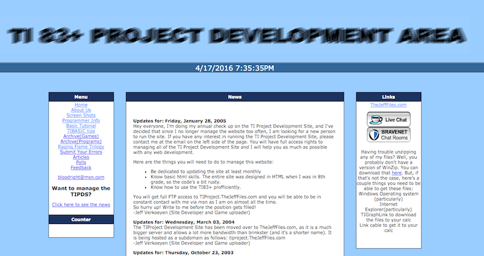
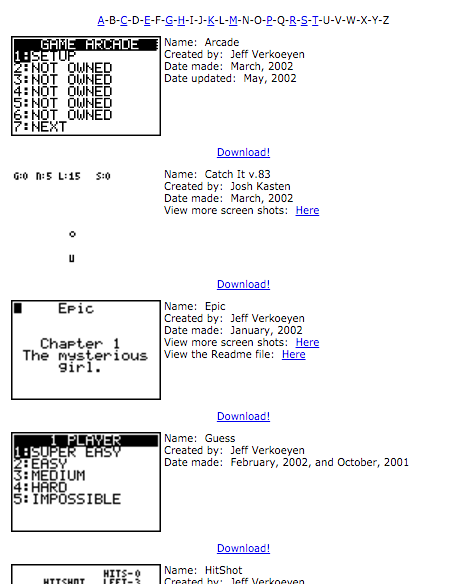

# TI83+ Project Development Area

> A chapter of featherless' [digital creative history](https://github.com/featherless/digital-creative-history).

From 2002 to 2005 I maintained the TI Project Development Site, or TIPDS. This site was my first
personal project storage ground.

- Active years: 2002-2003
- Language: Originally written in ASP but eventually converted to PHP
- Hosting: Originally on Brinkster, then moved to the custom domain TheJeffFiles.com

# Viewing the site

The site is written in PHP. Thankfully PHP 5.4.0 introduced a simple built-in php server. Simply
run the following to preview the site:

	git clone https://github.com/featherless/ti83plus-site.git
	cd ti83plus-site/src
	php -S localhost:8000

# Screenshots

# Blog entries

## Updates for: Friday, January 28, 2005

Hey everyone, I'm doing my annual check up on the TI Project Development Site, and I've decided that
since I no longer manage the website too often, I am looking for a new person to run the site. If
you have any interest in running the TI Project Development Site, please contact me at the email on
the left side of the page. You will have full access rights to managing all of the TI Project
Development Site and I will help you as much as possible with any web development.

Here are the things you will need to do to manage this website:

- Be dedicated to updating the site at least monthly
- Know basic html skills. The entire site was designed in HTML when I was in 8th grade, so the
  code's a bit rusty.
- Know how to use the TI83+ profficiently.

You will get full FTP access to TIProject.TheJeffFiles.com and you will be able to be in constant
contact with me via msn as I am on almost all the time.

So hurry up! Write to me before the position gets filled!

-Jeff Verkoeyen (Site Developer and Game uploader)

## Updates for: Wednesday, March 03, 2004

The TIProject Development Site has been moved over to TheJeffFiles.com, as it is a much bigger
server and allows a lot more bandwidth than brinkster (and it's a shorter name). It is being hosted
as a subdomain as follows: tiproject.TheJeffFiles.com

-Jeff Verkoeyen (Site Developer and Game uploader)

## Updates for: Thursday, October 23, 2003

Well, bad news about brinkster now, evidently they've found the urge to start having to put ads on
their hosted sites :(. Sorry everyone, but the Ad-free TIPDS will now be forced to have ads on it,
it's not my choice, so please don't direct any hate-mail at me, send it to brinkster about starting
placing ads on sites or something........

-Jeff Verkoeyen (Site Developer and Game uploader)

## Updates for: Tuesday, October 21, 2003

Hey again everybody, it's Jeff visiting back yet again. I'd like to say thank you VERY much for all
of those who email me asking questions, I love hearing input from the fans of the TIPDS. I would
just like to say that I believe that this site is truly a work from my heart, and without the
support of those who give feedback, this site could not have developed to what it is today. Again, I
would like to thank everyone who has visited this site in the past year of operation! Thanks
everyone!

-Jeff Verkoeyen (Site Developer and Game uploader)

## Updates for: Wednesday, September 8, 2003

Wow, hey everyone, it's been a VERY long time since I've updated this site, hehe. Sorry to everyone
here about that, I've been really busy with a new development time that I'm a part of, called The
Developer's Alliance. At TDA, we have recently finished our first game, Escape
From the Funky Factory, and are starting on a new one, which is requiring a LOT of work, so I
haven't really been working on TI83+ stuff recently. I would like to thank everyone who has been
emailing me, I love hearing feedback about the site, and if you ever have a question on anything
TI83+ related, just ask me and I'll get back to you as quick as I can. One note on the bad-side,
about 6 or 7 months ago, my computer's harddrive was wiped, therefor clearing every single one of
the calculator programs that I've ever created, so I lost most of the new Raging Flame engine and
such, but most of the stuff is recreatable, I just haven't really had the will to do so recently,
and I'm also developing video games for the computer now, so I guess I've moved on, heh. Have fun
with the games!

-Jeff Verkoeyen (Site Developer and Game uploader)

## Updates for: Wednesday, January 1, 2003

HAPPY NEW YEAR EVERYONE!!! It's the new year, and that means a whole nother year of game programming
is ahead :) Note to all the developers of the TIPDS, I will be posting any of your new programs
soon, I'm in Canada right now for X-mas, actually, I'm at the science center as we speak! So, I'll
sign off now, keep on gaming!

-Jeff Verkoeyen (Site Developer and Game uploader)

## Updates for: Wednesday, December 11, 2002

Hey everyone, I have just received a package in the mail from Washington D.C.!! It is a
recommendation and congratulations for making it in to the National Youth Leadership Forum on
Technology! This will be held in Summer, 2003, in Silicon Valley itself! So I'm probably going to be
spending the next few months working on projects to show there, so I'll have some really good games
to show off :). Hey, maybe they'll even like one of 'em! That would be cool. Anyways, I probably
won't update the site for a while, sorry to all you calc fans. But I have to start working hard to
keep my grades up and work on as many game projects as possible! Till next time, have fun gaming!

-Jeff Verkoeyen (Site Developer and Game uploader)

## Updates for: Thursday, November 14, 2002

The renovations are under-way and going fine. I have updated the TIBASIC tips section with a few
good tips that will help you out a lot. Also, I have made a lot of animated GIF's for a few of the
programs (so far Arcade, Memory, and TileFlip), so check 'em out in the games section. My next goal,
for tomorrow, will be to fill in all of the empty pictures in the programs archive.

-Jeff Verkoeyen (Site Developer and Game uploader)

## Updates for: Wednesday, November 13, 2002

Yet again, I'm going to do some renovations of the site. I have made quite a few new programs that
haven't gotten uploaded to the site yet, so you'll probably see about 10 more programs/games and
updates to games on the site. Also, I'm going to add some things to make it easier to browse the
archive (For Example, just click the letter of the program you want to go to, etc). If you have any
ideas to send to me, just send them to the email on the left, or post on the feedback board. I will
also be personally testing each and every individual file, to make sure that they work and are
updated/easy to run.

-Jeff Verkoeyen (Site Developer and Game uploader)

## Updates for: Thursday, November 07, 2002

Added a new link on the left (TIBASIC tips). It should help mostly everyone who has or does program
in BASIC.

-Jeff Verkoeyen (Site Developer and Game uploader)

## Updates for: Wednesday, November 06, 2002

I have just finished making an algorithm for a new memory game, there is almost infinite tiles you
can play on, and it'll take a long time to finish (it has a save feature).

-Jeff Verkoeyen (Site Developer and Game uploader)

## Updates for: Wednesday, October 23, 2002 (later that night)

YAY! I got everything updated, after about 1 hour of work, remaking the whole site (well, you won't
notice any difference, but actually, I just compacted the whole site in to about half the original
space! hehe, I love ASP) Also, I've gotten all of the games uploaded that I have. Oh! We also have a
new person being recruited to the team, called "Caleb S.". Once he gets me his bio and etc, I'll
have his stuff on the site, also. That's all again, and 'till next time, have fun gaming!

-Jeff Verkoeyen (Site Developer and Game uploader)

# License

All source code is licensed Apache 2.0.

> A chapter of featherless' [digital creative history](https://github.com/featherless/digital-creative-history).
